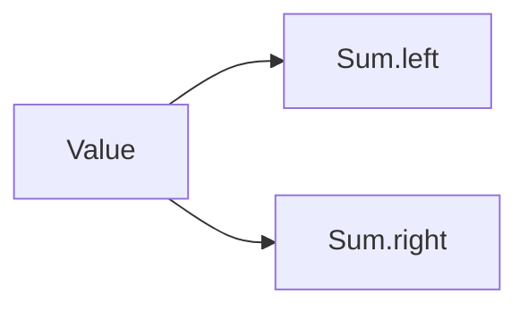

# Defining `Sum`

This post introduces a tiny sum type. The [companion post on using `Sum`](2026-8-2-using-sum-in-a-post/)
uses the definition in a different piece of writing, while the [`PostSource`](lean:LeanBlog.PostSource)
reference demonstrates a link from English prose to a generated Lean declaration.

```lean
inductive Sum (α β : Type) where
  | left : α → Sum α β
  | right : β → Sum α β
```

The value is always on exactly one side:


