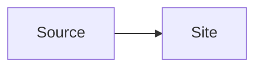

# Searchable heading

This post contains a searchable phrase for the generated-site fixture.

## Fixture details

The fixture checks ordinary prose, inline mathematics $a^2 + b^2 = c^2$, and a diagram.

